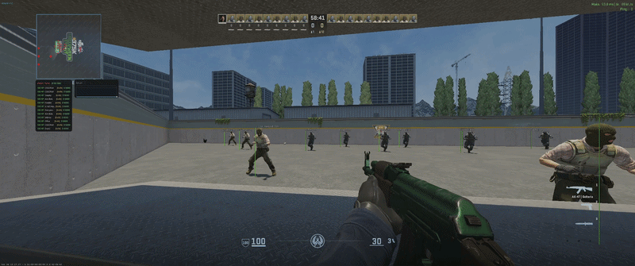

# Athenis

External overlay for Counter-Strike 2, written in Java. Reads game memory
through `ReadProcessMemory` (JNA) and renders with Dear ImGui on a transparent
GLFW/OpenGL window.

> For educational and research purposes only. Using this on VAC-secured
> servers violates the game's Terms of Service and can result in a permanent
> ban. The authors take no responsibility for misuse.

## Requirements

| | |
|---|---|
| OS | Windows 10 / 11, 64-bit |
| Java | JDK 21 or newer |
| Maven | 3.8 or newer (for building) |
| Game | Counter-Strike 2 (Steam), windowed fullscreen recommended |

The process must run **as Administrator**; `OpenProcess` on the CS2 process
fails otherwise.

## Building
bash git clone [https://github.com/VenixPLL/AthenisCS2.git](https://github.com/VenixPLL/AthenisCS2.git) cd AthenisCS2/athenis mvn package -DskipTests

This produces two artifacts in `athenis/target/`:

- `athenis-1.2.jar` – shaded fat jar, run with `java -jar`
- `athenis-1.2.exe` – launch4j wrapper around the same jar (requires a JRE 21+ on `PATH` or `JAVA_HOME`)

## Running

1. Start CS2 and load into a match or practice server.
2. Run `athenis-1.2.exe` or `java -jar athenis-1.2.jar` from an elevated shell.
3. Press **START** in the launcher. Offsets are fetched from
   [a2x/cs2-dumper](https://github.com/a2x/cs2-dumper) and fall back to the
   bundled copy when offline.
4. Press **/** (Slash) in-game to open the menu. **DELETE** is the default panic key.
5. **STOP** in the launcher detaches and closes the overlay.

If the launcher reports offset read errors, start it while already in a match
rather than from the main menu – the entity list isn't populated until then.

Settings persist to `%APPDATA%\Athenis\settings.json`. Map geometry patches
you create with the VisRay editor are stored in `%APPDATA%\Athenis\patches\`.

## Modules

### Visuals

| Module | Notes |
|---|---|
| ESP | Boxes, skeleton (with optional invisible-bones-only mode), health bar, names, enemy-only filter, forward extrapolation to compensate for read latency. Visibility is resolved against map geometry (see VisCheck below). Sub-features, each with its own toggle: |
| | **Player flags** – Blind, Scoped, Defusing/Planting, Kit, Bomb, Money. |
| | **Bomb carrier** – pulsing outline around whoever holds the C4. |
| | **Grenade ESP** – fuse timers for HE, flash, smoke, molotov/incendiary and decoy projectiles. |
| | **Damage ESP** – damage card, floating damage numbers, hit/kill marker, custom kill feed. Hits are attributed via `m_iShotsFired` transitions plus crosshair proximity. |
| | **Sound ESP** – directional footstep indicators synthesized from enemy velocity (CS2 doesn't expose its audio mixer). |
| | **Gaze ESP** – draws each enemy's view direction from `m_angEyeAngles`, clipped against map geometry, culled by proximity to you. |
| Radar | Minimap overlay with per-map alignment data (`data/radar_offsets.json`), rotation, zoom, C4 carrier highlight. |
| Bomb Timer | Countdown for a planted C4 with an off-screen warning banner. |
| Crosshair | Cross / dot / circle / T-shape; always on or sniper-only. |
| Speedometer | Movable HUD with a 2 s velocity graph. |
| Spectator List | Players currently spectating you. |

### Combat

| Module | Notes |
|---|---|
| Aimbot | Screen-space, bone-targeted. Hold or toggle activation, FOV limit, smoothing, selectable aim curve (Classic / PID spring / Human), flashbang check, VisCheck filter. |
| TriggerBot | Fires when the crosshair enters a chosen hitbox zone. Reaction delay, click duration, cooldown, one-shot mode, stop-when-moving. |
| Auto Weapon | Fires Zeus or knife when an enemy is inside effective range. |
| BunnyHop | Jump timing while Space is held. |

### Debug

| Module | Notes |
|---|---|
| VisRay Debug | Visualizes raycasts, hit points and hit triangles. Lets you delete/restore triangles at runtime and save the result as a patch. |
| Distance Debug | Perspective-scaled obstacle marker at the crosshair with a distance readout. |

### System pages (in the menu sidebar)

- **Settings** – menu key, panic key and scope (dangerous modules only / all), stream-proof mode (`SetWindowDisplayAffinity`, Windows 10 2004+), memory hex viewer toggle.
- **Console** – shared log with the launcher, level and text filters, command prompt.
- A performance window (JVM heap and process/system CPU) is shown while the menu is open.

## Console

The same console is available in the launcher and under `SYSTEM → Console`
in-game. Commands:
